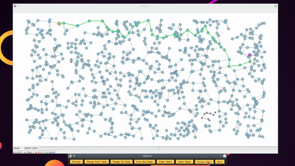
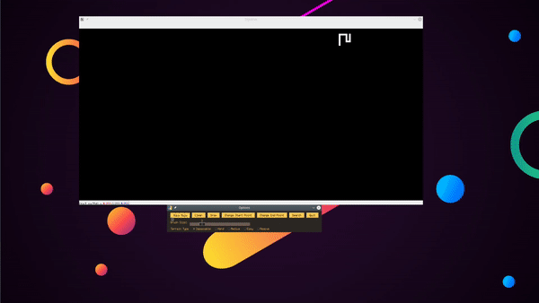
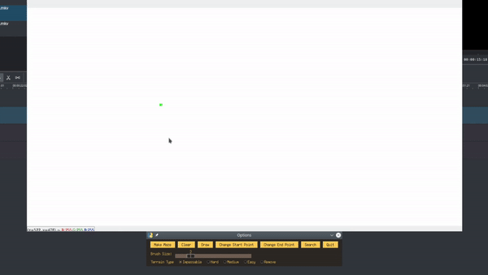

# python-tsp

## A python implementation of Dijkstra's shortest path algorithm.

- Find the shortest path on a node graph.

#### Install dependencies

First navigate to a directory where you want to download it to...

```
git clone https://github.com/lewis-morris/pydijkstras
cd pydijkstras
pip install -r requirements.txt

```

#### Run Code


Basic:

In download directory 

```
python run.py
```

Advanced:

```

optional arguments:
  -h, --help       show this help message and exit
  --width WIDTH    Width of the 'map' in pixels
  --height HEIGHT  Height of the 'map' in pixels
  --maze MAZE      Set to 1 if you want to view the maze and not the road
                   version


```

i.e 
```
python run.py --height 400 --width 400
```

## How to use

### Road Example



Once open you will see the completed, randomly generated node graph and the quickest route from A to B.


Using the above toolbar and node slider you can interact with the nodes.

- **Refresh** - refreshes a completely new configuration of nodes and edges (nodes amount is pulled from the node slider)

- **Change Start Node** - Click any node to set as the start point 

- **Change End Node** - Click any node to set as the end point

- **Draw New Nodes** - click on the map to add new nodes

- **Clear Nodes** - Clears all nodes

- **Clear Edges** - Clears all edges

- **Reload Edges** - Regenerates new edges for each node.

- **Quit** - Quit the program.

## Maze/ Draw Example





With maze mode enabled you can generate and solve a maze or draw your own.

#### Options

- **Make Maze** - Draws a completely random maze network

- **Clear** - Wipes the board clean 

- **Draw** - Draw walls or terrain (use the slider and radio buttons to change effect)

- **Change Start Point** - Click on the map to add an start point

- **Change End Point** - Click on the map to add an end point 

- **Search** - Click to run the search

- **Quit** - Quit the program.

#### Brush options

- **Brush Size** - Change the size of the brush you are drawing with

- **Terrain Type** - The harder the terrain the longer it takes to pass through.
  

  > - **Impassable** - or Walls
  > - **Hard** 
  > - **Medium** 
  > - **Easy** 
  > - **Remove** - An eraser

